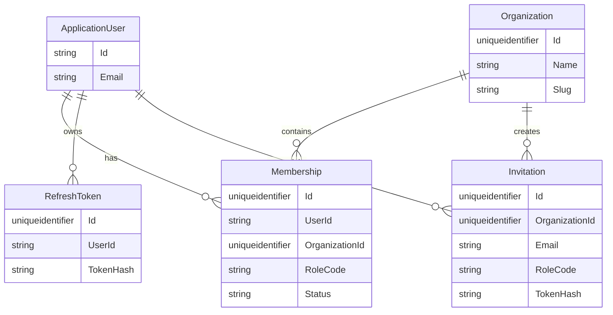

# Sprint 0 — Base SaaS y Multi-Tenant

## Objetivo

Construir el esqueleto técnico real del SaaS de gestión legal.

Al finalizar este sprint, un usuario debe poder:

- registrarse;
- iniciar sesión;
- recuperar su contraseña;
- crear una organización;
- pertenecer a una o varias organizaciones;
- seleccionar y cambiar la organización activa;
- invitar miembros;
- aceptar invitaciones;
- ver únicamente organizaciones y datos para los que tenga una membresía válida;
- cerrar sesión.

El Sprint 0 **no debe implementar Clientes, Casos, Agenda real, Documentos, pagos ni IA**.

---

# 1. Stack técnico

## Frontend

- React
- TypeScript
- Vite
- React Router
- Cliente HTTP centralizado
- Manejo de sesión y organización activa mediante Context o una solución simple equivalente
- Paleta visual principal: azul oscuro / azul legal

### Paleta base

```text
Primary:        #17324D
Primary Hover:  #0F2538
Secondary:      #2F5D8A
Soft Accent:    #DCE8F3
Background:     #F5F7FA
Surface:        #FFFFFF
Text Primary:   #17212B
Text Secondary: #667085
```

## Backend

- ASP.NET Core Web API
- .NET 8
- Entity Framework Core
- SQL Server
- ASP.NET Core Identity
- JWT Access Token
- Refresh Token propio y revocable
- FluentValidation opcional si aporta claridad; evitar sobrearquitectura

---

# 2. Principios de implementación

1. No crear microservicios.
2. No introducir Redis, MongoDB, colas o infraestructura adicional.
3. Mantener una arquitectura modular y simple.
4. El backend es la autoridad del tenant.
5. Nunca confiar en `OrganizationId` recibido dentro de DTOs de negocio.
6. Toda operación tenant-aware debe usar un `OrganizationId` previamente validado.
7. Un usuario puede pertenecer a varias organizaciones.
8. El rol pertenece a la membresía, no al usuario global.
9. La autenticación identifica al usuario; la membresía autoriza dentro de una organización.
10. El aislamiento multi-tenant debe tener prueba automatizada desde este sprint.

---

# 3. Estructura sugerida de solución

No sobrefragmentar la solución.

```text
legal-management/
│
├── backend/
│   ├── LegalManagement.sln
│   │
│   ├── src/
│   │   ├── LegalManagement.Api/
│   │   ├── LegalManagement.Application/
│   │   ├── LegalManagement.Domain/
│   │   └── LegalManagement.Infrastructure/
│   │
│   └── tests/
│       └── LegalManagement.IntegrationTests/
│
├── frontend/
│   └── legal-management-web/
│
└── README.md
```

Responsabilidades:

### Domain

- entidades;
- enums;
- reglas de dominio simples;
- sin dependencias de infraestructura.

### Application

- casos de uso;
- interfaces;
- DTOs;
- validaciones;
- autorización de aplicación cuando corresponda.

### Infrastructure

- EF Core;
- SQL Server;
- Identity;
- JWT;
- refresh tokens;
- email;
- persistencia.

### API

- endpoints;
- middleware;
- autenticación/autorización;
- resolución de tenant;
- configuración DI.

---

# 4. Modelo inicial

## ApplicationUser

Usar ASP.NET Core Identity.

Campos adicionales mínimos:

```text
Id
FirstName
LastName
Email
NormalizedEmail
EmailConfirmed
CreatedAt
IsActive
```

No duplicar campos gestionados por Identity sin necesidad.

---

## Organization

```text
Id
Name
Slug
Status
CreatedAt
CreatedByUserId
```

### Reglas

- `Name` obligatorio.
- `Slug` único.
- al crear una organización, el creador obtiene membresía `ADMIN`.
- una organización inactiva no puede operar normalmente.

---

## Membership

```text
Id
UserId
OrganizationId
RoleCode
Status
JoinedAt
```

Índice único obligatorio:

```text
UserId + OrganizationId
```

### RoleCode

```text
ADMIN
LAWYER
ASSISTANT
READONLY
```

### Status sugerido

```text
ACTIVE
SUSPENDED
```

No crear catálogo de roles en base de datos en este sprint salvo necesidad real.

---

## Invitation

```text
Id
OrganizationId
Email
RoleCode
TokenHash
ExpiresAt
AcceptedAt
CreatedAt
CreatedByUserId
Status
```

Estados sugeridos:

```text
PENDING
ACCEPTED
EXPIRED
REVOKED
```

### Importante

No almacenar el token de invitación en texto plano.

Persistir únicamente un hash del token.

---

## RefreshToken

```text
Id
UserId
TokenHash
CreatedAt
ExpiresAt
RevokedAt
ReplacedByTokenId
CreatedByIp
RevokedByIp
```

### Reglas

- token almacenado hasheado;
- revocable;
- rotación al refrescar;
- si ya fue revocado, no reutilizar;
- nunca devolver registros internos de refresh tokens.

---

# 5. Relaciones



---

# 6. Autenticación

## Access Token

JWT de corta duración.

Configuración sugerida:

```text
AccessTokenMinutes: 15
RefreshTokenDays: 7
```

Debe configurarse desde `appsettings`, no hardcodearse.

Claims mínimos:

```text
sub
email
jti
```

No incluir una organización fija dentro del JWT porque el usuario puede cambiar de tenant sin autenticarse nuevamente.

---

# 7. TenantContext

Crear una abstracción equivalente a:

```csharp
public interface ITenantContext
{
    Guid OrganizationId { get; }
    string UserId { get; }
    string RoleCode { get; }
    bool IsResolved { get; }
}
```

Implementar middleware o componente equivalente:

```text
Request
   ↓
JWT validado
   ↓
Leer X-Organization-Id
   ↓
Obtener UserId
   ↓
Consultar Membership ACTIVE
   ↓
No existe → 403
   ↓
Existe
   ↓
Crear TenantContext
   ↓
Endpoint / Application Service
```

### Reglas

- `X-Organization-Id` requerido solamente para endpoints tenant-aware.
- endpoints como `/api/auth/login`, `/api/me` o `/api/organizations` no requieren tenant activo.
- el rol se obtiene de la membresía validada.
- nunca aceptar el rol enviado desde React.

---

# 8. Autorización inicial

Políticas mínimas:

```text
OrganizationMember
OrganizationAdmin
```

### OrganizationMember

Requiere membresía activa.

### OrganizationAdmin

Requiere:

```text
RoleCode == ADMIN
```

Usar `OrganizationAdmin` inicialmente para:

- invitar miembros;
- consultar administración del equipo cuando aplique.

No crear un motor complejo de permisos todavía.

---

# 9. API Sprint 0

## Auth

```http
POST /api/auth/register
POST /api/auth/login
POST /api/auth/refresh
POST /api/auth/logout
POST /api/auth/forgot-password
POST /api/auth/reset-password
GET  /api/me
```

## Organizations

```http
GET  /api/organizations
POST /api/organizations
GET  /api/organizations/{id}
GET  /api/organizations/{id}/members
POST /api/organizations/{id}/invitations
```

## Invitations

```http
GET  /api/invitations/{token}
POST /api/invitations/{token}/accept
```

El `GET` es útil para que el frontend valide una invitación antes de mostrar el formulario de aceptación.

---

# 10. Contratos principales

## POST /api/auth/register

Request:

```json
{
  "firstName": "Juan",
  "lastName": "Perez",
  "email": "juan@example.com",
  "password": "********"
}
```

No crear automáticamente una organización desde este endpoint.

Después del registro:

```text
0 organizaciones → onboarding
1 organización   → entrar directamente o mostrar selección
N organizaciones → selector
```

---

## POST /api/organizations

Request:

```json
{
  "name": "Perez Legal"
}
```

Backend:

1. crea organización;
2. crea `Membership` del usuario actual;
3. asigna `RoleCode = ADMIN`;
4. todo dentro de una transacción.

---

## POST /api/organizations/{id}/invitations

Headers:

```text
Authorization: Bearer ...
X-Organization-Id: <id>
```

Request:

```json
{
  "email": "abogado@example.com",
  "roleCode": "LAWYER"
}
```

Validaciones:

- usuario actual debe ser `ADMIN`;
- `{id}` debe coincidir con tenant activo;
- rol válido;
- evitar membresía duplicada;
- manejar invitación pendiente existente;
- token con expiración.

---

# 11. Recuperación de contraseña

Usar mecanismos de token de ASP.NET Core Identity.

El backend debe generar el enlace, pero el email real puede abstraerse.

En desarrollo se permite:

- proveedor de email simulado;
- escribir URL de recuperación/invitación en logs de desarrollo;
- nunca hacerlo en producción.

Crear interfaz:

```text
IEmailSender
```

Implementaciones:

```text
DevelopmentEmailSender
```

Posteriormente se sustituirá por proveedor real.

---

# 12. Frontend

## Rutas públicas

```text
/login
/register
/forgot-password
/reset-password
/invitations/:token
```

## Rutas autenticadas

```text
/onboarding
/select-organization
/app
/app/team
```

---

# 13. Estado de sesión en React

Mantener separado:

```text
AuthContext
TenantContext / OrganizationContext
```

### AuthContext

```text
user
accessToken
authenticated
login()
logout()
refresh()
```

### OrganizationContext

```text
organizations
activeOrganization
selectOrganization()
clearOrganization()
```

Persistencia sugerida:

- refresh token preferiblemente mediante cookie HttpOnly si la arquitectura elegida lo permite;
- evitar guardar refresh token en `localStorage`;
- organización activa puede persistirse mediante almacenamiento local únicamente como preferencia;
- backend siempre debe volver a validar la membresía.

---

# 14. Cliente HTTP

Centralizar:

```text
Authorization: Bearer {accessToken}
X-Organization-Id: {activeOrganizationId}
```

El segundo header solo se agrega si existe organización activa.

Debe existir manejo central de:

```text
401 → intentar refresh / redirigir login
403 → mostrar acceso denegado
```

Evitar lógica repetida en cada componente.

---

# 15. UX Sprint 0

Implementar con la identidad visual definida.

## Login

- correo;
- contraseña;
- recordar sesión;
- recuperar contraseña;
- crear cuenta;
- acceder mediante invitación.

## Registro

- nombre;
- apellido;
- correo;
- contraseña;
- confirmar contraseña.

## Selección de organización

Mostrar:

```text
Nombre
Rol
Entrar
```

Agregar:

```text
Crear nueva organización
```

## Crear organización

Solo:

```text
Nombre de la organización
```

No agregar datos fiscales, planes, pagos ni configuraciones adicionales todavía.

## Layout autenticado

Sidebar:

```text
Dashboard
Clientes
Casos
Agenda
Documentos
Equipo
Configuración
```

En Sprint 0 solo debe funcionar realmente:

```text
Dashboard base
Equipo
Cambio de organización
Logout
```

Las demás rutas pueden mostrarse deshabilitadas o como placeholder si es necesario.

## Organización y equipo

Debe permitir:

- ver organización actual;
- listar miembros;
- mostrar rol;
- invitar miembro si es ADMIN.

---

# 16. Dashboard base

No implementar dashboard de negocio.

Mostrar únicamente una pantalla inicial coherente con los mockups:

```text
Bienvenido
Organización activa
Rol actual
Acciones disponibles
```

El Dashboard completo corresponde a un sprint posterior.

---

# 17. Base de datos

Crear primera migración con:

```text
AspNetUsers
AspNetRoles / Identity tables requeridas
Organizations
Memberships
Invitations
RefreshTokens
```

Agregar índices:

```text
Memberships(UserId, OrganizationId) UNIQUE
Organizations(Slug) UNIQUE
Invitations(TokenHash) UNIQUE
RefreshTokens(TokenHash) UNIQUE
```

Revisar índices adicionales para:

```text
Invitations(OrganizationId, Email, Status)
Memberships(OrganizationId, Status)
```

---

# 18. Pruebas obligatorias

Crear proyecto de integration tests.

## Caso crítico

```text
Given:
Usuario A pertenece a Organización A
Usuario A NO pertenece a Organización B

When:
Usuario A llama un endpoint tenant-aware
con X-Organization-Id = Organización B

Then:
HTTP 403 Forbidden
```

Agregar además pruebas mínimas para:

```text
Registro exitoso
Login exitoso
Crear organización crea Membership ADMIN
Listar organizaciones retorna solamente memberships del usuario
Aceptar invitación crea Membership
```

Prioridad máxima:

**prueba de aislamiento entre tenants**.

---

# 19. Logging

Registrar eventos técnicos relevantes sin información sensible:

```text
UserRegistered
LoginSucceeded
LoginFailed
OrganizationCreated
OrganizationSelected
InvitationCreated
InvitationAccepted
TenantAccessDenied
RefreshTokenRevoked
```

No loguear:

```text
password
access token
refresh token
reset token
invitation token
```

---

# 20. Configuración

Usar variables/configuración para:

```text
ConnectionStrings
Jwt:Issuer
Jwt:Audience
Jwt:SigningKey
Jwt:AccessTokenMinutes
Jwt:RefreshTokenDays
FrontendUrl
Cors:AllowedOrigins
```

No subir secretos reales al repositorio.

Agregar configuración de ejemplo si es necesario.

---

# 21. Criterios de aceptación

- [ ] Backend y frontend compilan desde cero.
- [ ] SQL Server y migraciones funcionan.
- [ ] Usuario puede registrarse.
- [ ] Usuario puede iniciar sesión.
- [ ] Refresh token funciona y rota.
- [ ] Logout revoca refresh token.
- [ ] Recuperación y reset de contraseña funcionan.
- [ ] Usuario sin organizaciones entra a onboarding.
- [ ] Puede crear organización.
- [ ] Se crea automáticamente Membership `ADMIN`.
- [ ] Un usuario puede pertenecer a dos organizaciones.
- [ ] Selector solo muestra sus organizaciones.
- [ ] Puede cambiar organización sin nueva autenticación.
- [ ] Endpoint tenant-aware devuelve `403` para una organización no autorizada.
- [ ] ADMIN puede invitar miembro.
- [ ] Invitación expira.
- [ ] Usuario invitado puede aceptarla.
- [ ] Se crea Membership con el rol invitado.
- [ ] Pantalla Equipo lista miembros.
- [ ] Paleta azul legal aplicada.
- [ ] Existe prueba automatizada de aislamiento multi-tenant.
- [ ] No existen funcionalidades de Clientes/Casos fuera de placeholders.

---

# 22. Definition of Done

Sprint 0 termina solamente cuando puede demostrarse este flujo:

```text
Usuario A se registra
        ↓
Login
        ↓
No tiene organizaciones
        ↓
Crea "Bufete A"
        ↓
Membership ADMIN
        ↓
Entra al layout
        ↓
Invita Usuario B
        ↓
Usuario B acepta
        ↓
Usuario B pertenece a Bufete A
        ↓
Usuario B crea "Bufete B"
        ↓
Usuario B puede cambiar entre A y B
        ↓
Usuario A intenta acceder a B
        ↓
403 Forbidden
```

---

# 23. Restricciones para Codex

- No implementar funcionalidades fuera del Sprint 0.
- No hacer refactors especulativos.
- No introducir microservicios.
- No introducir Redis.
- No introducir MongoDB.
- No implementar pagos.
- No implementar IA.
- No implementar Clientes ni Casos.
- No confiar en tenant enviado en body/query.
- No almacenar tokens sensibles en texto plano.
- No colocar secretos en código.
- Priorizar código legible, testeable y simple.
- Documentar cualquier decisión técnica importante que cambie lo definido aquí.

---

# 24. Entregables

Al terminar, entregar:

1. solución backend compilable;
2. frontend compilable;
3. scripts/migraciones de base de datos;
4. README con ejecución local;
5. endpoints documentados vía Swagger/OpenAPI;
6. pruebas automatizadas;
7. breve reporte:
   - qué se implementó;
   - qué quedó pendiente;
   - decisiones técnicas tomadas;
   - cómo ejecutar;
   - cómo probar aislamiento multi-tenant.

---

## Resultado esperado

Al cerrar el Sprint 0 debe existir un **esqueleto SaaS real, seguro y multi-tenant**, listo para que Sprint 1 implemente Clientes sin tener que rediseñar autenticación, organizaciones ni aislamiento de datos.
